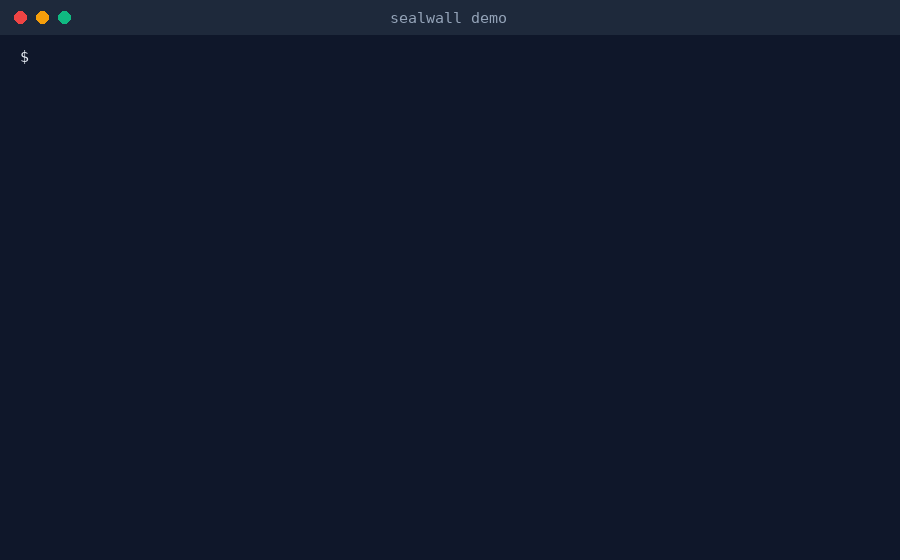

# sealwall

<p align="center">
  <a href="https://pypi.org/project/sealwall/"></a>
  <a href="https://python.org"></a>
  <a href="https://modelcontextprotocol.io"></a>
  <a href="LICENSE"></a>
  <a href="#running-tests"></a>
  <a href="https://github.com/vishalmurugan1986/sealwall/actions"></a>
  
</p>

<p align="center">
  <strong>A zero-dependency security proxy and tamper-evident audit logger for Model Context Protocol (MCP) AI agents.</strong>
</p>

---

Autonomous AI agents executing tools on local and remote systems are vulnerable to prompt injection, tool poisoning, credential extraction, and unauthorized filesystem access. Malicious web pages, untrusted repositories, and poisoned documents can instruct agents to exfiltrate private keys, read sensitive files, or execute destructive actions.

`sealwall` is a lightweight, local-first firewall proxy that sits between AI clients (such as Claude Desktop, Cursor, or autonomous agent frameworks) and any MCP server. It enforces deterministic security policies prior to execution, prevents tool-definition poisoning, sanitizes tool outputs, and records every transaction in a cryptographically chained, tamper-evident audit log.

<p align="center">
  
</p>

---

## Core Capabilities

- **Deterministic Policy Enforcement**: Default-deny architecture supporting granular tool allowlists, regular expression argument filters, and fail-closed human approval workflows for sensitive operations.
- **Tamper-Evident Audit Trails**: Every tool request, argument payload, execution timestamp, and server response is hashed into an immutable SHA-256 chain. Modifications, deletions, or line reorderings break verification.
- **Output Injection Defense**: Evaluates tool responses against known prompt injection and instruction-override heuristics, withholding malicious content before it enters the agent's context window.
- **Tool-Poisoning and Rug-Pull Defenses**: Inspects `tools/list` payloads for concealed instructions in descriptions (e.g., hidden directives instructing models to access credentials). Pins tool signatures on first observation to block unauthorized runtime schema or description mutations.
- **Path Canonicalization and Sandbox Validation**: Canonicalizes file arguments across Windows, macOS, and Linux. Automatically expands home directories, environment variables, relative paths (`../`), symlinks, directory junctions, and file URIs (`file://`), rejecting any access outside designated path boundaries.
- **Secret Scanning and Automated Redaction**: Intercepts credential leaks (including AWS credentials, GitHub tokens, Slack tokens, OpenAI keys, and private keys) in tool arguments, and redacts matching patterns from tool outputs before return to the client.
- **Signed Audit Heads and Compliance Reporting**: Supports HMAC signing (`sealwall seal`) to detect log truncation or selective history rewrites. Generates standalone HTML and CSV evidence reports aligned with SOC 2, HIPAA, and ISO 27001 control requirements.
- **Pluggable Classifier Integration**: Supports external classification binaries or scripts via policy configuration to perform model-based analysis on inputs and outputs, failing closed on unexpected termination.
- **Dual Transport Architecture**: Transparently wraps standard stdio MCP subprocesses or operates as an HTTP reverse proxy for remote MCP servers (`http://127.0.0.1:8787`).
- **Zero Supply-Chain Dependencies**: Built exclusively with the Python standard library. Requires no external dependencies, installs in seconds, and eliminates third-party supply-chain risks.

---

## Architecture

```text
┌────────────────┐           ┌────────────────────────────────┐           ┌────────────────┐
│   AI Client    │           │           sealwall             │           │   MCP Server   │
│ (Claude/Cursor)│ ──JSON-RPC──> 1. Intercept tools/call       │           │  (FS, DB, CLI) │
│                │           │  2. Validate policy & paths    │ ──Forward──>               │
│                │           │  3. Log to SHA-256 hash chain  │           │                │
│                │ <─────────│  4. Scan response & redact     ├──Response─│                │
│                │           │  5. Return sanitized result    │           │                │
└────────────────┘           └────────────────────────────────┘           └────────────────┘
```

---

## Installation

### From PyPI

```bash
pip install sealwall
```

### From Source

```bash
git clone https://github.com/vishalmurugan1986/sealwall.git
cd sealwall
pip install -e .
```

---

## Quickstart

### 1. Execute the Interactive Demo

Run the end-to-end demonstration to observe policy blocking, injection interception, and cryptographic tamper detection:

```bash
python demo.py
```

Expected output:
```text
[1] Agent asks the server which tools exist
    server offers 2 tools: read_file, add (poisoned)
    sealwall passes on: ['read_file'] <- 'add' removed (hidden instructions)

[2] Agent calls tools
    read_file    -> file contents
    read_file    -> Blocked by sealwall: path '<work>\..\secret.txt' is outside allowed paths
    read_file    -> Blocked by sealwall: argument matches \.ssh
    delete_file  -> Blocked by sealwall: destructive action
    send_email   -> Blocked by sealwall: outbound communication (human review: fail-closed)
    fetch_page   -> [sealwall] Output withheld: possible prompt injection

[3] Verifying hash chain integrity
Audit log intact

[4] Simulating log tampering (edit one decision)
TAMPERED at line 4
```

---

## CLI Usage

### Wrapping a Stdio MCP Server

Prepend `sealwall` to any existing MCP server command:

```bash
sealwall --policy policy.json --log audit.jsonl -- <server-command> [args...]
```

**Example:** Securing the standard Model Context Protocol filesystem server:
```bash
sealwall --policy policy.json --log audit.jsonl -- npx -y @modelcontextprotocol/server-filesystem ./workspace
```

### Wrapping a Remote HTTP MCP Server

To protect a remote streamable HTTP server, run `sealwall` as a local reverse proxy:

```bash
sealwall --policy policy.json --http-upstream https://remote-mcp.internal/api --listen 8787
```

Direct your AI client to connect to `http://127.0.0.1:8787/`.

---

## Command Reference

| Command / Flag | Description | Default |
|----------------|-------------|---------|
| `--policy <path>` | Path to JSON policy configuration file (**required**) | - |
| `--log <path>` | Destination file for the JSONL hash-chained audit log | `audit.jsonl` |
| `--interactive` | Prompt for human approval in terminal for `"action": "ask"` | `False` (fail-closed) |
| `--ask-timeout <sec>` | Approval prompt timeout in seconds before failing closed | `15.0` |
| `--pins <path>` | Tool definition signature storage file | `<log>.pins.json` |
| `--accept-changes` | Re-pin tools whose schemas or descriptions have changed | `False` |
| `--http-upstream <url>` | Upstream HTTP endpoint for remote MCP proxy mode | - |
| `--listen <port>` | Local listening port for HTTP reverse proxy mode | `8787` |
| `sealwall verify <log>` | Verify cryptographic hash chain and optional HMAC seal | - |
| `sealwall seal <log> --key <key>` | Generate cryptographic HMAC seal for current log head | - |
| `sealwall report <log>` | Generate standalone HTML and CSV compliance reports | - |
| `sealwall tail <log>` | Live, colored terminal stream of incoming audit events | - |
| `sealwall keygen <path>` | Generate a cryptographically secure 256-bit HMAC key | - |

---

## Configuration

### Policy Specification (`policy.json`)

Policies are defined in standard JSON format:

```json
{
  "default": "deny",
  "allow_paths": [
    "./workspace",
    "/var/data/shared"
  ],
  "deny_paths": [
    "./workspace/confidential"
  ],
  "deny_args": [
    "\\.ssh",
    "\\.env",
    "id_rsa",
    "api[_-]?key"
  ],
  "block_secrets": true,
  "redact_secrets": true,
  "rules": [
    { "tool": "read_*", "action": "allow" },
    { "tool": "fetch_*", "action": "allow" },
    { "tool": "send_*", "action": "ask", "reason": "outbound communication" },
    { "tool": "delete_*", "action": "deny", "reason": "destructive action" }
  ]
}
```

### Policy Properties

- **`rules`**: Tool-matching rules evaluated in order using standard wildcards (`*`, `?`). Actions:
  - `allow`: Permit execution immediately.
  - `deny`: Block execution with a structured JSON-RPC error.
  - `ask`: Require human approval. In non-interactive contexts (background daemons, IDE clients), automatically fails closed.
- **`allow_paths`**: Array of directories permitted for filesystem tools. Any path reference resolving outside these locations (via relative traversal, symlink, junction, or file URI) is rejected.
- **`deny_paths`**: Array of directories explicitly forbidden, even if located within an allowed path.
- **`deny_args`**: Regular expressions evaluated across serialized arguments. Matching requests are denied regardless of tool allow rules.
- **`block_secrets`**: When `true` (default), blocks requests containing detected API tokens, AWS keys, or private key blocks.
- **`redact_secrets`**: When `true` (default), redacts detected credentials in tool output payloads before forwarding to the client.
- **`default`**: Fallback action when no rules match (`"deny"` recommended).

---

## Client Integration

### Claude Desktop

Add `sealwall` as the wrapper executable in `claude_desktop_config.json`:

```json
{
  "mcpServers": {
    "secure-filesystem": {
      "command": "sealwall",
      "args": [
        "--policy", "C:/path/to/policy.json",
        "--log", "C:/path/to/audit.jsonl",
        "--",
        "npx", "-y", "@modelcontextprotocol/server-filesystem", "C:/path/to/workspace"
      ]
    }
  }
}
```

### Cursor & IDE Agents

Configure your MCP server command in settings with `sealwall` prepended to the command array.

---

## Operational Procedures

### Cryptographic Auditing & Sealing

1. **Generate a Dedicated Key:**
   ```bash
   sealwall keygen audit.key
   ```
   *Store this key securely, outside the host executing the agent.*

2. **Sign the Audit Log Head:**
   ```bash
   sealwall seal audit.jsonl --key audit.key
   ```
   Generates `audit.jsonl.seal` containing the record count, head digest, and HMAC signature.

3. **Verify Audit Trail Integrity:**
   ```bash
   sealwall verify audit.jsonl --key audit.key
   ```
   Validates the SHA-256 hash chain and verifies the HMAC seal against the signed checkpoint. Subsequent additions to the log remain verifiable without invalidating the seal.

4. **Generate Evidence Reports:**
   ```bash
   sealwall report audit.jsonl --out audit-report.html --csv audit-events.csv
   ```
   Produces an HTML visual dashboard and CSV data export with automated CSV formula sanitization.

5. **Live Monitoring:**
   ```bash
   sealwall tail audit.jsonl
   ```
   Streams incoming audit events to stdout in real time.

---

## Benchmark Suite (`bench.py`)

`sealwall` includes a standalone, reproducible attack evaluation suite testing 12 distinct attack vectors against any MCP stdio proxy:

```bash
# Baseline evaluation (unprotected server)
python bench.py --wrap ""

# Evaluation through sealwall
python bench.py --wrap "sealwall --policy policy.json --log bench.jsonl --"
```

### Evaluated Attack Vectors

1. Secret file access (`~/.ssh/id_rsa`)
2. Path traversal (`../secret.txt`)
3. Symlink and junction escape
4. Case-variation evasion (`~/.SSH/ID_RSA`)
5. Configuration file leakage (`.env`)
6. Destructive tool execution (`delete_file`)
7. Credential exposure in arguments (AWS access keys)
8. JSON-RPC batching bypass attempts
9. Tool definition poisoning via injected directives
10. Prompt injection in tool execution outputs
11. Secret leakage in tool output payloads
12. Tool definition mutation across sessions (rug-pull attacks)

Evaluation results depend on policy rules (e.g., path boundaries must be configured in the policy to stop path escapes). Full methodology and reproduction steps are accessible directly in [bench.py](bench.py).

---

## Running Tests

Execute the comprehensive unit and integration test suite:

```bash
python -m unittest test_sealwall.py
```

The test suite covers policy decisions, cryptographic hash chains, seal verification, prompt injection detection, path canonicalization, tool poisoning defense, HTTP proxy streaming, secret redaction, and Windows/POSIX edge cases.

---

## Author & Support

Developed and maintained by **[Vishal Murugan](https://github.com/vishalmurugan1986)**.

For security reports, feature discussions, or enterprise inquiries, please open an [issue](https://github.com/vishalmurugan1986/sealwall/issues) on GitHub.

---

## License

This project is licensed under the MIT License. See [LICENSE](LICENSE) for details.
